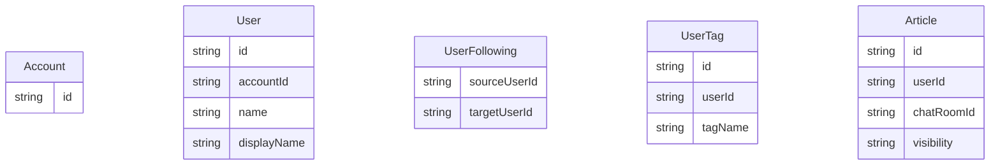
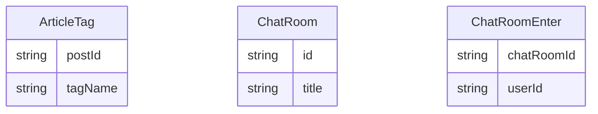
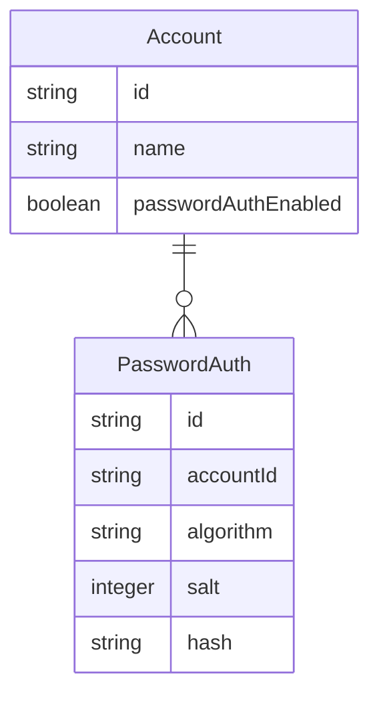
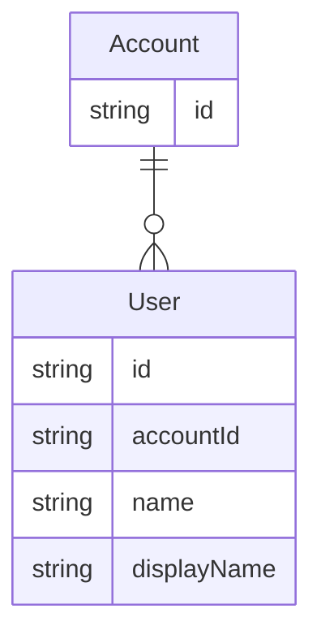
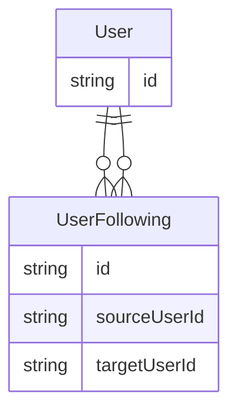
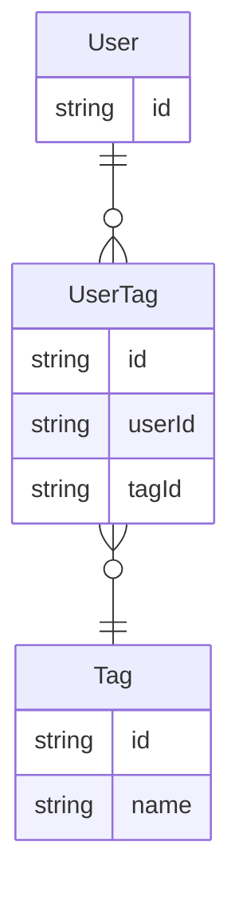
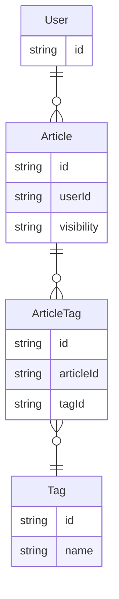
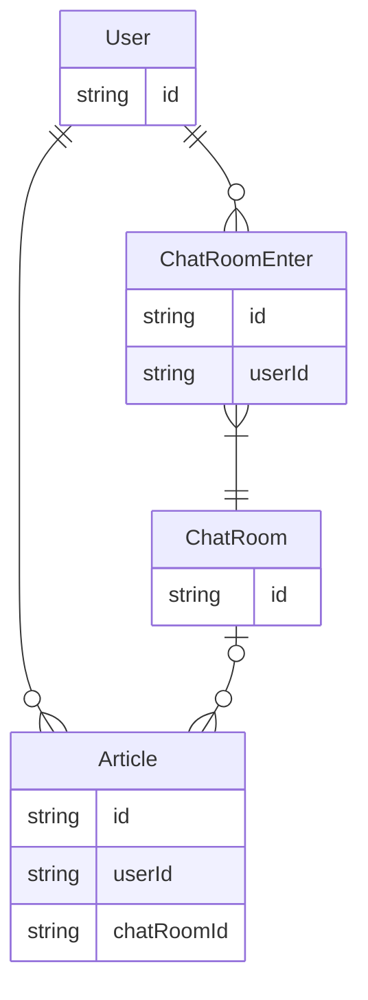

# テーブル設計

# ER図

## パスワード認証

## ユーザープロファイル
アカウントは複数のユーザープロファイルを作成できる。

## ユーザーのフォロー
ユーザーは他のユーザーをフォローできる。

## ユーザータグ
ユーザーには関心のある物事をタグとして設定できる。

## タイムラインへの投稿
ユーザーは短い記事を投稿できる。\
記事には公開範囲を設定することができる。

## チャットルーム
チャットルームに入室して投稿を作成することができます。\
投稿自体はタイムラインの物と共通ですが、こちらはcharRoomIdが入ります。

