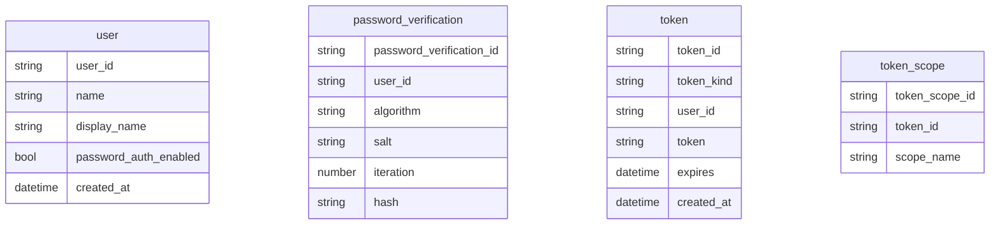
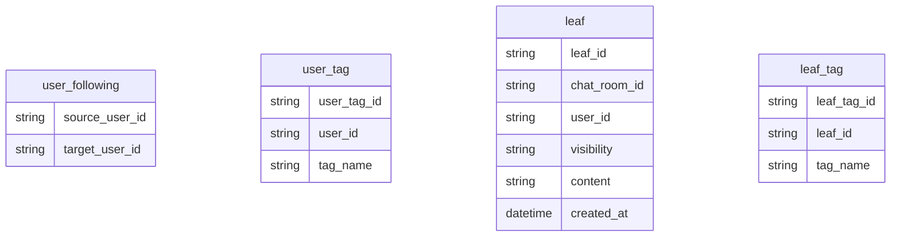
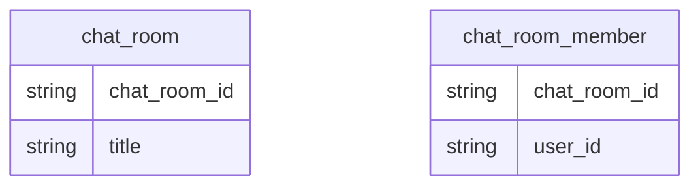
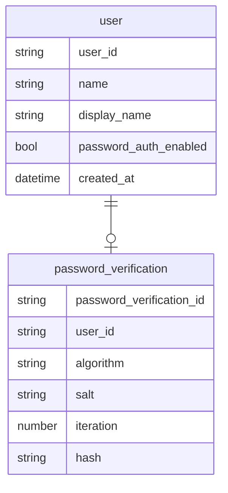
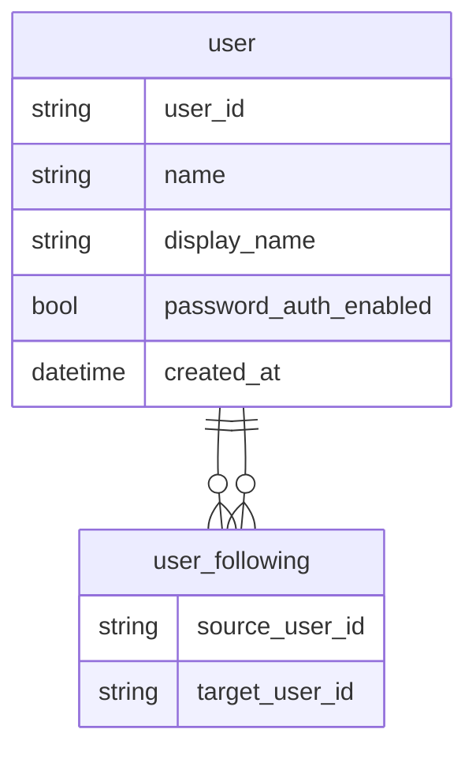
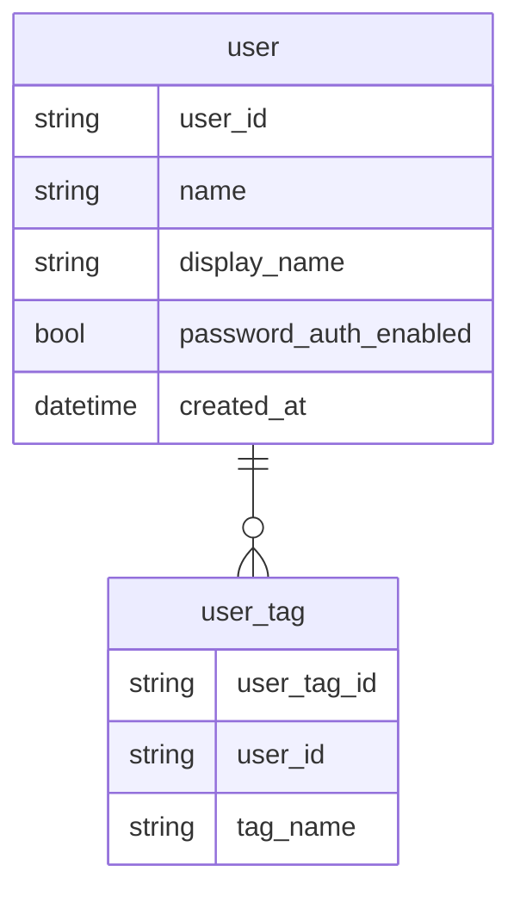
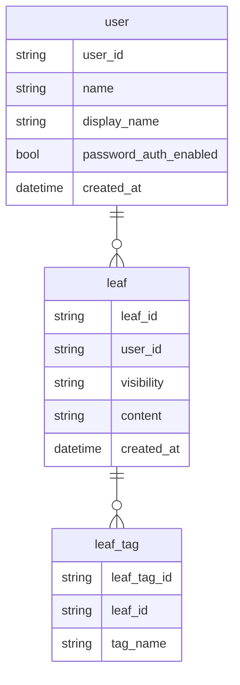
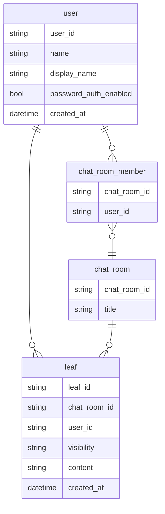

# テーブル設計

# ER図

## パスワード認証
ユーザーには基本的に1つのパスワードが設定される。
他の認証方法がある場合やサインインできない特殊なユーザーでは設定されない可能性がある。

## ユーザーのフォロー
ユーザーは他のユーザーをフォローできる。\
多対多の関係を中間テーブルで保持する。

## ユーザータグ
ユーザーには関心のある物事をタグとして設定できる。

## タイムラインへの投稿
ユーザーは短い記事を投稿できる。\
記事には公開範囲を設定することができる。

## チャットルーム
チャットルームに入室して投稿を作成することができます。\
投稿自体はタイムラインの物と共通ですが、こちらはcharRoomIdが入ります。

